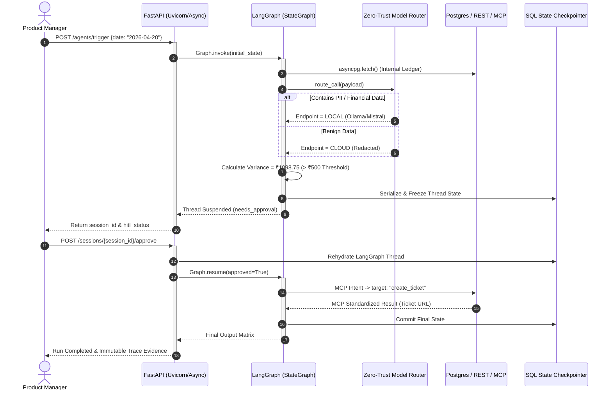

# FinAgent Platform: Technical Showcase & Architecture

## 🚀 The 2-Minute Tech Pitch (Why This Matters)
"Most enterprise 'AI apps' are just stateless wrappers around an OpenAI API. Today, we are demonstrating a **durable, stateful AI orchestration engine** built on **LangGraph, FastAPI, and local LLMs**. 

We've solved the three hardest problems in financial AI: **Statefulness**, **Data Privacy**, and **System Safety**. 

This platform doesn't just 'think'—it executes predictable Finite State Machines (FSMs). It intercepts its own memory, detects sensitive PII, and automatically hot-swaps to an air-gapped **Ollama/Mistral** model on the fly to prevent data leaks. And when it encounters a risky financial decision, it physically suspends its execution thread to an **SQLite checkpoint**, waits for human approval via our async API, and resumes seamlessly using the bleeding-edge **Model Context Protocol (MCP)** standard to interface with internal tooling."

## 🏗️ Core Architecture (Low-Level Design)

We built this using a modern, asynchronous Python 3.11+ stack:

*   **Stateful Orchestration Engine (LangGraph + SQLite):** The workflow is compiled as a `StateGraph`. Unlike standard ReAct loops that lose context or hallucinate, our agent transitions through strict deterministic nodes (`load_data` → `reconcile` → `check_gate`). We use SQLite as a checkpoint backend to freeze and rehydrate the graph's state mid-execution.
*   **Zero-Trust Model Router (Privacy Engine):** Before any data hits an LLM, the `PayloadClassifier` analyzes the state matrix. If it detects SSNs, account numbers, or strict financial parameters, the `ModelRouter` severs cloud communication and routes the inference task to a local **Ollama** container (`gemma:2b` or `mistral`).
*   **Asynchronous Connectors & MCP:** The agent doesn't talk directly to databases. It emits abstract intents that our `ConnectorRegistry` executes via **asyncpg** (for bare-metal Postgres speed) and HTTP. Crucially, write actions (like creating Jira tickets) use the **Model Context Protocol (MCP)**, decoupling the AI from the tool implementations entirely.
*   **High-Concurrency API Layer (FastAPI + Pydantic):** The entire boundary is strongly typed and async. We capture execution traces and tool-call latency in real-time, backed by an append-only immutable audit logger.

## 🔍 What You Are About to See (The Demo Execution Trace)

1. **Initialization:** A `POST /agents/trigger` hits FastAPI. LangGraph initializes an `AgentState` matrix and fetches mock ledger rows from PostgreSQL and mock Exchange APIs.
2. **Algorithmic & AI Hybrid Reconciliation:** The system bypasses the LLM for deterministic math (FX rates and matrix diffing). The LLM is strictly reserved for fuzzy-matching unstructured discrepancies, minimizing token waste. 
3. **The Interrupt (Thread Suspension):** The computed variance exceeds our ₹500 hard-coded threshold. LangGraph emits a `human_gate` audit event, serializes its entire execution stack, dumps it to SQLite, and halts the active thread.
4. **Human-in-the-Loop Resumption:** An analyst reviews the cryptographic trace via `GET /sessions/{id}`. Upon `POST /approve`, FastAPI rehydrates the LangGraph thread from SQLite memory. The agent wakes up, recognizes the approval, and fires an MCP intent to create an actionable ticket.

## 📊 Architecture Diagram

