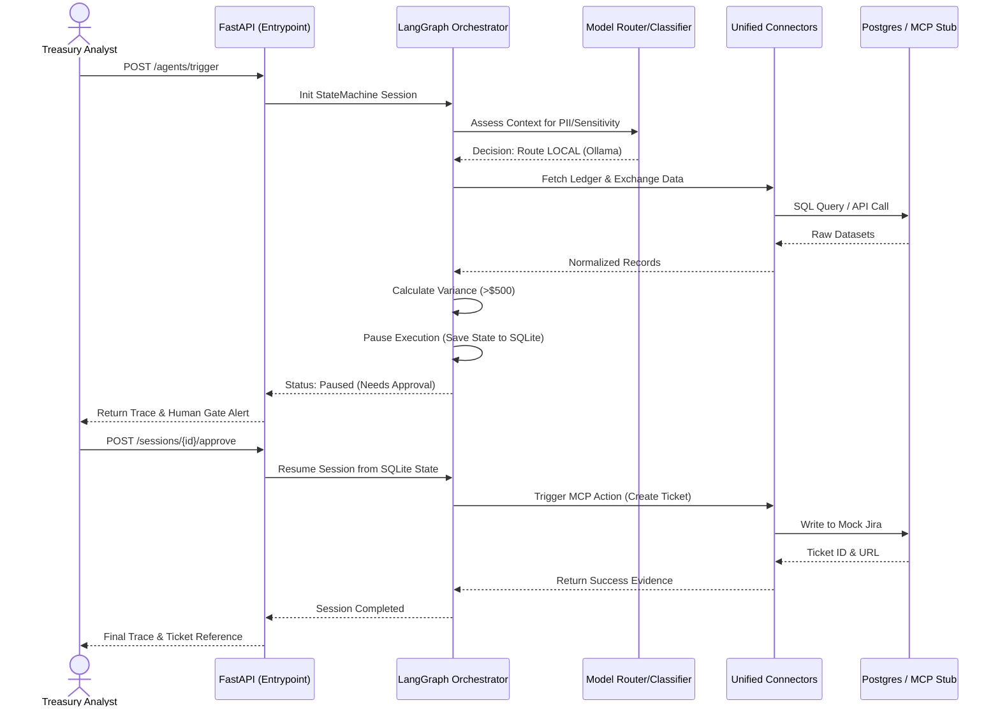

# FinAgent Platform MVP: Demo Pitch & Architecture Guide

This document is designed to be read in **2-3 minutes** right before the demo. It breaks down the system's architecture, what each component does, and exactly how they interact under the hood.

---

## ⏱️ The 2-Minute Elevator Pitch
"Today, we're demonstrating the **FinAgent MVP**, a secure, stateful AI agent platform built for financial services. Rather than just wrapping an LLM in a UI, we've built a multi-agent orchestration engine that guarantees safety. 

In this demo, the agent will perform an End-of-Day Settlement Reconciliation. It will fetch our internal ledger, fetch mock third-party exchange data, apply FX rates, and find discrepancies. But more importantly, you will see three enterprise patterns in action:
1. **Dynamic Privacy Routing:** It inspects data on the fly. If it sees PII or sensitive financial data, it routes the LLM task to a local, air-gapped model (Ollama/Mistral). If benign, it uses the cloud.
2. **Immutable Audit Trails:** Every routing decision, database query, and execution time is logged immutably.
3. **Human-in-the-Loop:** Once it finds a variance over $500, the AI cannot proceed. It physically halts its execution state, waiting for a human analyst to approve the creation of an investigation ticket via MCP."

---

## 🧩 High-Level Components

* **API Layer (FastAPI):** The entry point. Handles async REST requests to trigger runs, fetch session traces, and submit human approvals.
* **Orchestrator (LangGraph):** The "Brain". It models the reconciliation workflow as a predictable finite state machine (Load → Reconcile → Check Gate → Await Approval → Finalize).
* **Model Router & Classifier:** The "Bouncer". Uses regex and heuristics to catch SSNs, Account Numbers, and PII. Returns a routing decision (`LOCAL`, `CLOUD`, or `REDACTED`).
* **Connectors:** The "Hands". A unified interface (`ConnectorRegistry`) to talk to Postgres (Ledger), REST (Exchange), and MCP (Jira/ServiceNow Stub).
* **Session & Audit Managers:** The "Memory". Uses SQLite to track exactly what happened, persisting the LangGraph state so the agent can go to sleep while waiting for human input and wake back up perfectly.

---

## ⚙️ Low-Level System Interaction

1. **Trigger Phase:** The user hits FastAPI with a payload. The system generates a `session_id`, sets up the SQLite state, and tells LangGraph to begin the `ReconciliationAgent` flow starting at the `load_data` node.
2. **Data Aggregation & Routing:** Inside LangGraph, before calling out to an AI model, the payload passes through the **Payload Classifier**. If PII is found, the **Model Router** returns a local endpoint. The agent uses the **Postgres Connector** and **REST Connector** to gather the raw datasets.
3. **Execution & Gate Check:** The agent reconciles the data and calculates the total financial variance. It hits the `check_gate` node. Since the variance > $500, it triggers the `human_gate` event, persists its state to SQLite, and halts.
4. **Approval & Resumption:** The human calls the `/approve` endpoint. The API fetches the frozen state from SQLite, injects the human's approval payload, and tells LangGraph to resume. The agent wakes up, uses the **MCP Connector** to output a Jira ticket, and finalizes the run.

---

## 📊 Architecture Diagram

