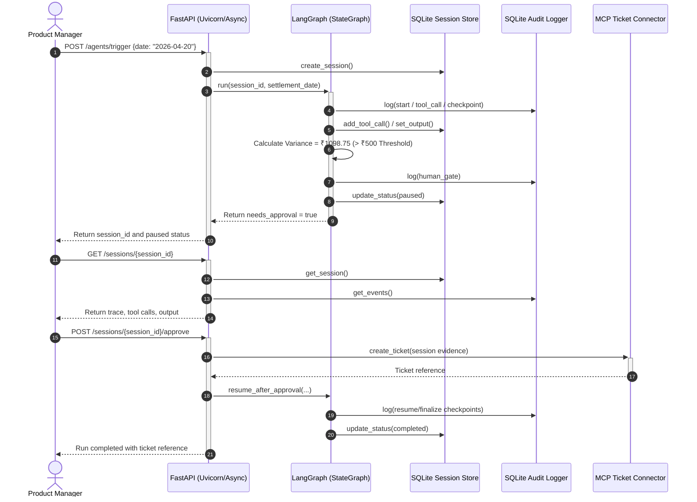

# FinAgent Platform: Technical Showcase & Architecture

## 🚀 The 2-Minute Tech Pitch (Why This Matters)
"Most enterprise 'AI apps' are just stateless wrappers around an OpenAI API. Today, we are demonstrating a **durable, stateful AI orchestration engine** built on **LangGraph, FastAPI, and local LLMs**. 

We've solved the three hardest problems in financial AI: **Statefulness**, **Data Privacy**, and **System Safety**. 

This platform doesn't just 'think'—it executes a predictable Finite State Machine (FSM). The current demo runs a deterministic reconciliation workflow through explicit graph nodes, persists session state and audit checkpoints in **SQLite**, pauses when a risky financial decision needs review, and then resumes after approval to create a ticket through the **Model Context Protocol (MCP)**. The result is a local, auditable, human-in-the-loop execution path rather than a black-box prompt loop."

## 🏗️ Core Architecture (Low-Level Design)

We built this using a modern, asynchronous Python 3.11+ stack:

*   **Stateful Orchestration Engine (LangGraph + SQLite):** The workflow is compiled as a `StateGraph` with strict deterministic nodes (`load_data` → `reconcile` → `check_gate`). Session status, tool calls, output summaries, and checkpoint events are persisted into SQLite-backed session and audit stores so the run can pause and resume safely.
*   **Deterministic Reconciliation Core:** The current demo path does not rely on an LLM for the actual reconciliation step. It compares seeded internal and exchange records, applies FX conversion, computes discrepancies, and marks critical variances above the configured ₹500 threshold.
*   **Approval Gate + MCP Ticketing:** Once the threshold is breached, the workflow stores the reconciliation result, marks the session as `paused`, and waits for human approval. After approval, an MCP connector creates an investigation ticket and the session is marked `completed`.
*   **FastAPI Trace Surface:** FastAPI exposes trigger, health, session trace, and approval endpoints. The trace response includes redacted tool-call payloads, immutable audit events, and the persisted reconciliation output for demo walkthroughs.

## 🔍 What You Are About to See (The Demo Execution Trace)

1. **Initialization:** A `POST /agents/trigger` hits FastAPI. The API creates a session record in SQLite, then invokes the LangGraph workflow with a `settlement_date`.
2. **Deterministic Reconciliation:** The graph loads seeded internal and exchange records that mirror the local demo fixtures, applies FX rates, and computes matched rows plus discrepancies.
3. **The Interrupt (Human Gate):** If any discrepancy exceeds the ₹500 threshold, the workflow writes checkpoint and `human_gate` audit events, persists the reconciliation output, marks the session `paused`, and returns control to the API.
4. **Human-in-the-Loop Completion:** A product manager reviews the trace via `GET /sessions/{id}`. On `POST /sessions/{id}/approve`, the approval service calls the MCP connector to create a ticket, records the approval checkpoint, and marks the session `completed`.

## 📊 Architecture Diagram

